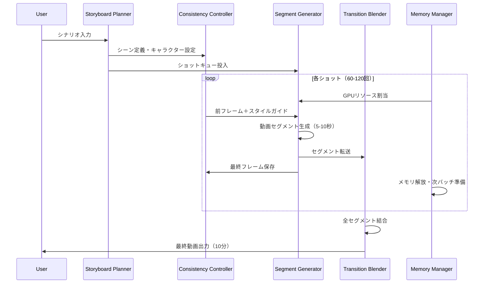

# 長時間動画生成エージェント 技術要件書

## 1. プロジェクト概要

### 1.1 目的
連続的で映画のような10分間の動画を自動生成できるAIシステムを構築する。

### 1.2 背景・課題
- 現在のAI動画生成モデル（OpenAI Sora、Google Veo、Runway等）は数秒〜20秒程度の生成が限界
- 長時間動画には複数セグメントの結合が必要だが、シーン間の一貫性維持が困難
- GPU メモリ制約（最大使用率92%）に対応した効率的な処理が必要

### 1.3 スコープ
- **Phase 1**: 技術要件書作成 ← 現在のフェーズ
- **Phase 2**: アプリ構築スケジュール策定
- **Phase 3**: 不足エージェントの追加

---

## 2. 技術調査結果

### 2.1 主要AIモデル比較

| モデル | 最大出力長 | 解像度 | 特徴 | ライセンス |
|--------|------------|--------|------|-----------|
| **OpenAI Sora 2** | 20秒 | 1080p | Storyboard機能、Blend/Remix編集 | 商用API |
| **Google Veo 3.1** | 2分 | 4K | ネイティブ音声生成、Flow編集環境 | 商用API |
| **Runway Gen-4** | 10秒（拡張可） | 1080p | Aleph編集機能、キーフレーム制御 | 商用API |
| **Luma Ray2** | 9秒 | 高解像度 | 自然な動き、Modify Video機能 | 商用API |
| **Wan2.1/2.2** | 5秒 | 480p〜 | 8GB VRAM対応、MoEアーキテクチャ | OSS (Apache 2.0) |
| **CogVideoX 1.5** | 10秒 | 720p+ | 8GB GPU対応、続編生成機能 | OSS |
| **NVIDIA LongLive** | 60秒+ | 高解像度 | AR backbone、長時間特化 | 研究段階 |

### 2.2 長時間動画生成の技術課題

#### 2.2.1 時間的一貫性 (Temporal Consistency)
- フレーム間の物理的な連続性維持
- キャラクター・オブジェクトの外見一貫性
- シーン遷移時の滑らかな接続

#### 2.2.2 現在の解決アプローチ
1. **Segmented Cross-Attention (SCA)**: 時間軸に沿ってセグメント分割し、各セグメントにサブキャプションを対応
2. **Space-Time U-Net**: 時空間同時ダウンサンプリングで全体を一括生成（Lumiere）
3. **TECO (Temporally Consistent Transformer)**: 長期一貫性に特化した圧縮・展開アーキテクチャ
4. **Frame Interpolation**: 開始/終了フレーム制約による補間
5. **Sparse Inter-Shot Attention**: ショット内は密、ショット間は疎なアテンション（HoloCine）

### 2.3 GPUメモリ最適化技術

#### 2.3.1 Wan2.1で実装されている技術
- **Model Offloading**: GPU↔CPUメモリ間の動的移動
- **FSDP (Fully Sharded Data Parallel)**: 複数GPU間でのパラメータ分散
- **勾配チェックポイント**: 順伝播時の中間状態を再計算で削減

#### 2.3.2 一般的な最適化戦略
- **AOS→SOA変換**: メモリアクセスパターンの最適化
- **非同期実行**: データ転送と計算のオーバーラップ
- **Producer-Consumer Locality**: GPU内データコピー削減

---

## 3. システムアーキテクチャ

### 3.1 全体構成

```
┌─────────────────────────────────────────────────────────────┐
│                    Long Video Agent                         │
├─────────────────────────────────────────────────────────────┤
│  ┌──────────────┐  ┌──────────────┐  ┌──────────────┐      │
│  │  Storyboard  │  │   Segment    │  │   Render     │      │
│  │   Planner    │→│  Generator   │→│   Engine     │      │
│  └──────────────┘  └──────────────┘  └──────────────┘      │
│         │                 │                 │               │
│         ▼                 ▼                 ▼               │
│  ┌──────────────────────────────────────────────────┐      │
│  │              Consistency Controller               │      │
│  │  (Character Memory / Scene Graph / Style Guide)   │      │
│  └──────────────────────────────────────────────────┘      │
│         │                 │                 │               │
│         ▼                 ▼                 ▼               │
│  ┌──────────────────────────────────────────────────┐      │
│  │              GPU Memory Manager                   │      │
│  │  (Offloading / FSDP / Gradient Checkpoint)       │      │
│  └──────────────────────────────────────────────────┘      │
├─────────────────────────────────────────────────────────────┤
│  ┌──────────────┐  ┌──────────────┐  ┌──────────────┐      │
│  │  Video Model │  │  Transition  │  │  Upscaler    │      │
│  │  (Wan2.1等)  │  │   Blender    │  │  (Optional)  │      │
│  └──────────────┘  └──────────────┘  └──────────────┘      │
└─────────────────────────────────────────────────────────────┘
```

### 3.2 コンポーネント詳細

#### 3.2.1 Storyboard Planner
- **責務**: 10分の動画をシーン/ショットに分解
- **入力**: ユーザープロンプト（シナリオ概要）
- **出力**:
  - シーンリスト（推定60〜120ショット）
  - 各ショットのプロンプト
  - キャラクター/ロケーション定義
- **技術**: LLM（Claude/GPT）によるシナリオ分解

#### 3.2.2 Segment Generator
- **責務**: 各ショット（5〜10秒）の動画生成
- **入力**: ショットプロンプト + 前フレームコンテキスト
- **出力**: 生成された動画セグメント
- **技術**: Wan2.1 / CogVideoX / 商用API（ハイブリッド対応）

#### 3.2.3 Consistency Controller
- **責務**: 全体を通じた一貫性維持
- **機能**:
  - **Character Memory**: キャラクター外見の特徴ベクトル保持
  - **Scene Graph**: 空間的配置関係の追跡
  - **Style Guide**: 色調/ライティング/カメラスタイルの統一

#### 3.2.4 Transition Blender
- **責務**: セグメント間のシームレス結合
- **技術**:
  - Frame Interpolation（中間フレーム生成）
  - Cross-Fade / Cut判定
  - 音声同期（将来対応）

#### 3.2.5 GPU Memory Manager
- **責務**: 92%メモリ制約下での効率的処理
- **機能**:
  - バッチサイズ動的調整
  - Model Offloading制御
  - 並列ワーカー管理

### 3.3 処理フロー



---

## 4. 技術要件

### 4.1 機能要件

| ID | 要件 | 優先度 | 備考 |
|----|------|--------|------|
| FR-001 | 10分間の連続動画生成 | P0 | 60〜120ショット構成 |
| FR-002 | 映画的なクオリティ | P0 | 1080p以上、24fps |
| FR-003 | キャラクター一貫性維持 | P0 | 同一人物の外見固定 |
| FR-004 | シーン遷移の滑らかさ | P1 | カット/フェード適切選択 |
| FR-005 | スタイルガイドに基づく統一感 | P1 | 色調・ライティング |
| FR-006 | 自然言語によるシナリオ入力 | P0 | 日本語/英語対応 |
| FR-007 | 進捗のリアルタイム表示 | P2 | 生成中ショットの可視化 |
| FR-008 | 中断・再開機能 | P2 | チェックポイント保存 |

### 4.2 非機能要件

| ID | 要件 | 目標値 | 備考 |
|----|------|--------|------|
| NFR-001 | GPUメモリ使用率 | ≤92% | 動的調整必須 |
| NFR-002 | 生成時間（10分動画） | ≤4時間 | RTX 4090想定 |
| NFR-003 | 並列処理効率 | ≥80% | GPU使用率 |
| NFR-004 | 障害時自動復旧 | 必須 | セグメント単位で再試行 |
| NFR-005 | スケーラビリティ | 水平拡張可 | 複数GPU対応 |

### 4.3 技術スタック（推奨）

#### 4.3.1 コア技術
- **言語**: Python 3.11+, TypeScript（フロントエンド）
- **フレームワーク**:
  - PyTorch 2.x（GPU計算）
  - FastAPI（APIサーバー）
  - Celery/Redis（タスクキュー）
- **動画処理**: FFmpeg, OpenCV
- **AI/ML**:
  - Wan2.1 / CogVideoX（OSS動画生成）
  - Claude API / GPT-4（シナリオ生成）
  - 商用API（Sora/Veo/Runway）オプション対応

#### 4.3.2 インフラ
- **GPU**: NVIDIA RTX 4090 / A100 / H100
- **メモリ**: 64GB+ RAM
- **ストレージ**: NVMe SSD（高速I/O）
- **オーケストレーション**: Docker, Kubernetes（将来）

### 4.4 制約条件

1. **メモリ制約**: GPU使用率92%以下厳守
2. **モデルサイズ**: 推論時8〜16GB VRAM想定
3. **ネットワーク**: 商用API使用時は帯域に依存
4. **著作権**: 生成コンテンツのライセンス確認必要

---

## 5. Miyabiエージェント構成

### 5.1 既存エージェント活用

| エージェント | 役割 |
|-------------|------|
| CoordinatorAgent | 全体タスク分解・DAG構築 |
| CodeGenAgent | コンポーネント実装コード生成 |
| ReviewAgent | コード品質チェック（80点基準） |
| IssueAgent | サブIssue管理・ラベリング |
| PRAgent | Draft PR自動作成 |
| DeployAgent | デプロイ・ヘルスチェック |

### 5.2 追加が必要なエージェント

| エージェント | 責務 | 優先度 |
|-------------|------|--------|
| **StoryboardAgent** | シナリオ→ショット分解、プロンプト生成 | P0 |
| **VideoGenAgent** | 動画セグメント生成制御、モデル切替 | P0 |
| **ConsistencyAgent** | キャラクター/スタイル一貫性監視 | P0 |
| **TransitionAgent** | セグメント結合、補間処理 | P1 |
| **MemoryAgent** | GPUリソース監視・最適化 | P1 |
| **QualityAgent** | 生成品質評価、再生成判定 | P2 |

---

## 6. リスクと対策

| リスク | 影響度 | 対策 |
|--------|--------|------|
| 一貫性破綻 | 高 | Character Memory + 再生成ループ |
| GPUメモリ不足 | 高 | 動的バッチサイズ調整、Offloading |
| 生成時間超過 | 中 | 並列処理、商用API併用 |
| モデル品質不足 | 中 | 複数モデル切替、ハイブリッド構成 |
| APIレート制限 | 中 | キュー管理、バックオフ実装 |
| コスト超過 | 中 | OSS優先、商用は高品質シーンのみ |

---

## 7. 参考資料

### 7.1 技術ドキュメント
- [OpenAI Sora](https://openai.com/sora/)
- [Google Veo](https://deepmind.google/models/veo/)
- [Runway Gen-3/Gen-4](https://runwayml.com/research/introducing-gen-3-alpha)
- [Wan2.1 GitHub](https://github.com/Wan-Video/Wan2.1)
- [CogVideoX GitHub](https://github.com/zai-org/CogVideo)
- [NVIDIA LongLive](https://medium.com/data-science-in-your-pocket/nvidia-longlive-real-time-interactive-long-video-generation-31f59fd5234a)

### 7.2 研究論文
- [Presto: Segmented Cross-Attention for Long Video](https://arxiv.org/html/2412.01316v1)
- [TECO: Temporally Consistent Transformers](https://arxiv.org/abs/2210.02396)
- [HoloCine: Multi-Shot Narratives](https://studio.aifilms.ai/blog/holocine-ai-film-multishot-narratives)
- [FusionFrames: Text-to-Video Pipeline](https://arxiv.org/abs/2311.13073)
- [Spatiotemporal Consistency Survey](https://arxiv.org/html/2502.17863v1)

### 7.3 比較レビュー
- [Zapier: Best AI Video Generators 2025](https://zapier.com/blog/best-ai-video-generator/)
- [KDnuggets: Open Source Video Models](https://www.kdnuggets.com/top-5-open-source-video-generation-models)
- [Luma AI Dream Machine Review](https://skywork.ai/blog/luma-ai-dream-machine-review-2025-features-pricing-comparisons/)

---

## 8. 次のステップ

1. **アプリ構築スケジュール策定** - Phase 2
2. **不足エージェントの実装** - Phase 3
3. **プロトタイプ開発** - 1分動画から開始

---

**作成日**: 2025-11-30
**作成者**: Miyabi AI Agent
**親Issue**: #2 長時間動画エージェント
**ステータス**: レビュー待ち
